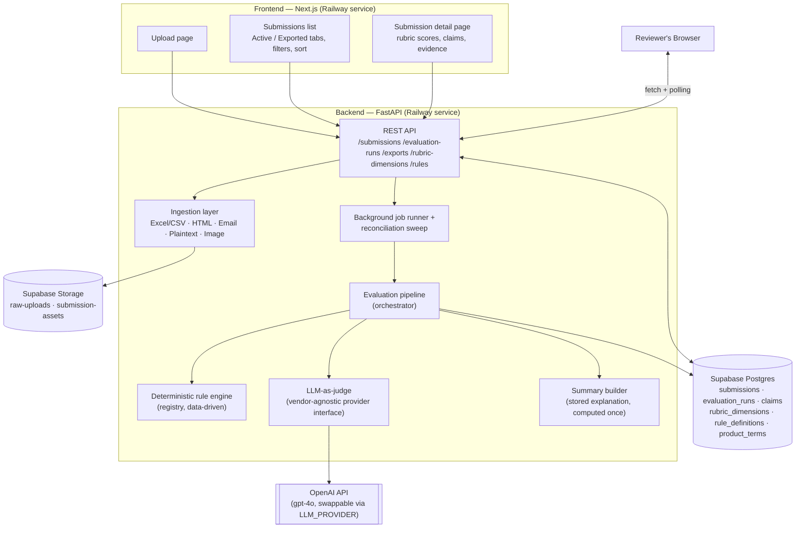

# Affiliate Marketing Compliance Review Tool

Right now this application is currently deployed at: https://marketing-review-app-frontend-production.up.railway.app

An internal tool for **ClearPath Financial**-style consumer financial services companies (personal loans, credit cards, mortgage prequalification) to review affiliate marketing content for compliance — replacing a manual Excel + email process with an pipeline for reviewers that combines **deterministic rule checks** and an **LLM-as-judge** pass, scored against a structured rubric. This rubric can be changed or updated based on the insititutions reviewing process.

A reviewer uploads content (a single web page/email/ad, or a bulk Excel/CSV batch), the system evaluates it automatically in the background, and the reviewer sees a clear pass/fail/needs-review result with the specific reasons why — or, for a passing result, the specific claims to spot-check — before exporting to Excel to close the loop with the existing process. The provides the user some level of explainabaility and keeps a human in the loop, in case the institution would like that final review check to be done by a human.

## Architecture



Two independent evaluation paths meet in one orchestrator (`app/evaluation/pipeline.py`): **deterministic rules** (phrase blocklist, disclosure proximity, promo-condition presence, prequalification/approval conflation, product-terms cross-checks) for fast exact checks, and a **single multimodal LLM call** scored against an 8-dimension rubric for everything requiring actual judgment. Both are data-driven — new rules or rubric dimensions are database rows, not code changes — and the LLM provider itself sits behind an interface so the model/vendor can be swapped via one env var, in case after more evaluation testing, a different model is determined better for evaluations. 

## Documentation map

| Doc | Covers |
|---|---|
| [`docs/design.md`](docs/design.md) | Full architecture/design doc — schema, folder structure, deployment rationale |
| [`marketing-test-examples/CLAIMS.md`](marketing-test-examples/CLAIMS.md) | Test fixtures (10 passing / 10 failing) with a verified answer key |
| [`reference-docs/`](reference-docs/affiliate_marketing_guidelines_consumer_financial_services.md) | The compliance guidelines — the actual policy source of truth |
| [`reference-docs/`](reference-docs/Financial Marketing Evaluation Methods.md) | The doc with further research and methodology on performing this type of evaluation task |

## Repo layout

```
backend/                  FastAPI app (ingestion, evaluation pipeline, API) — see backend/app/
frontend/                 Next.js app (upload UI, submissions list/detail, export)
docs/design.md            Architecture & design doc
marketing-test-examples/  Sample content + bulk-upload template for exercising the pipeline
reference-docs/           Compliance guidelines (policy source of truth)
```

## Stack

FastAPI · Next.js (App Router) · Supabase (Postgres + Storage) · OpenAI (behind a swappable provider interface) · Railway


## Future Steps

- **Email notifications** — once a submission is exported, automatically email its POC contact with the outcome and specific feedback (the `reasons` / `claims_to_verify` already stored in `evaluation_runs.summary`), instead of a reviewer writing that up by hand.
- **Clearer intake assumptions** — the upload flow currently assumes reviewers manage submissions via a shared Excel sheet; understanding how marketing teams actually submit content today would clarify whether that holds or a different intake path is needed.
- **Stronger image support for social posts** — image-heavy content isn't well covered yet; adding OCR to the evaluation pipeline would let claims and disclosures embedded purely in an image be extracted and checked with the same rigor as text.
- **Role-based access** — restrict marketing users to the upload page only, or support ingesting submissions directly via a monitored email inbox, so the tool could fully replace the manual process rather than sit alongside it.
- **Ground-truth evaluation of the evaluation method itself** — benchmark the LLM-as-judge and deterministic layers against a labeled dataset with known outcomes to actually measure accuracy, rather than relying on the hand-curated `marketing-test-examples/` fixtures alone.